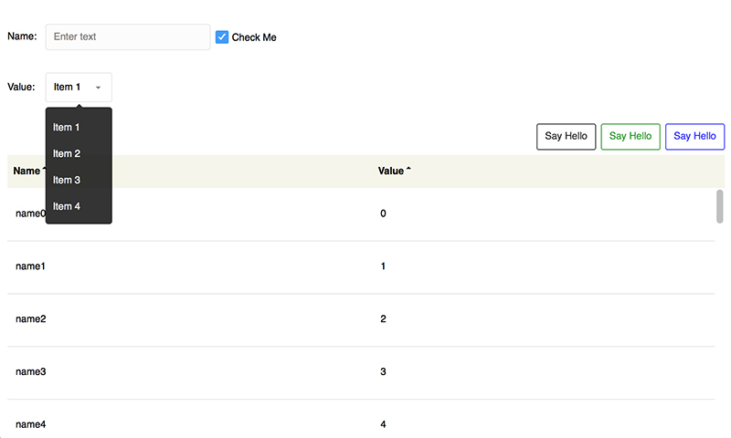
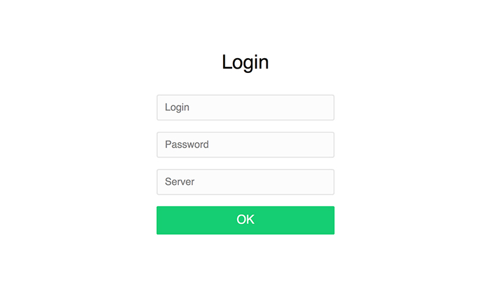

# flex4-nice-skins

Попытка сделать набор скинов для Adobe Flex 4, который не выглядел бы ужасающе вырвиглазно 
(а именно так выглядят абсолютно все существующие скины для флекса). Для тех несчастных, кто вынужден использовать Adobe Flex в 21 веке

Usage:

* Link library flex4-nice-skins.swc to your project
* Copy niceskins.css to source folder
* Add line `<fx:Style source="niceskins.css"/>` to main mxml file

Supported controls:

* Button
* CheckBox
* DataGrid
* DropDownList
* Form
* Scroller
* TextInput
* NumericStepper

Bonus:

* LoginView

